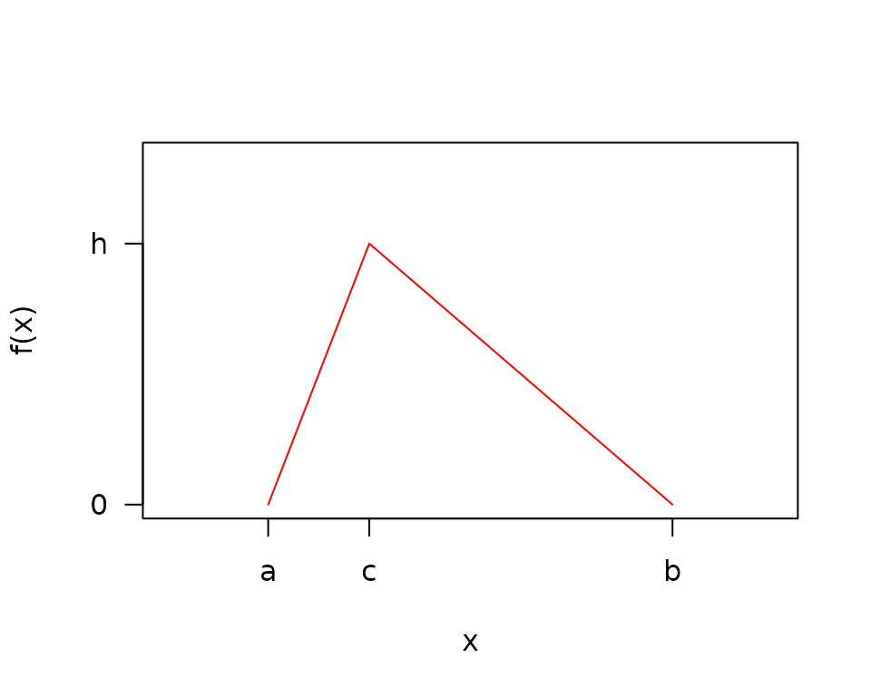

# Triangle Distribution Math

## Triangle Notation

- $a$ = minimum
- $b$ = maximum
- $c$ = mode
- $h$ = density at the mode = $\frac{2}{b - a}$

## Triangle Probability Density Funciton (PDF)

**Lemma 1: (Triangle PDF).**

*Given,* $x,a,b,c \in {\mathbb{R}}$*and* $a \leq c < b$*or*
$a < c \leq b$*the triangle probability density function is given by*

$$f(x) = \begin{cases}
{\frac{2}{(b - a)(c - a)}(x - a)} & {{\text{if}\mspace{6mu}}a \leq x \leq c} \\
{\frac{2}{(b - a)(c - b)}(x - b)} & {{\text{if}\mspace{6mu}}c < x \leq b} \\
0 & \text{otherwise}
\end{cases}$$

*if a random variable X has a PDF f(x), then we say*
$X \sim triangle(a,b,c)$

**Proof**

The triangle is made of two lines:

$$(y - 0) = \frac{h - 0}{c - a}(x - a)$$

$$(y - 0) = \frac{h - 0}{c - b}(x - b)$$

Integrating the pdf under these two equations to solve for $h$:

$$\int f(x)dx = 1$$

$$\frac{h}{c - a}\int_{a}^{c}(x - a)dx + \frac{h}{c - b}\int_{c}^{b}(x - b)dx = \frac{h(b - a)}{2} = 1$$

$$h = \frac{2}{b - a}$$

The PDF should be zero at each end of the interval and be continuous at
$c$

$$f(a) = \frac{2}{(b - a)(c - a)}(a - a) = 0$$

$$f(b) = \frac{2}{(b - a)(c - b)}(b - b)$$

$$f_{a \leq x \leq c}(c) = \frac{2}{(b - a)(c - a)}(c - a) = \frac{2}{(b - a)}$$

$$\lim\limits_{x\rightarrow c}f_{c < x \leq b}(x) = \lim\limits_{x\rightarrow c}\frac{2}{(b - a)(c - b)}(x - b) = \frac{2}{(b - a)}$$

## Triangle Cumulative Distribution Function (CDF)

**Lemma 2: (Triangle CDF).**

*Given,* $x,a,b,c \in {\mathbb{R}}$*and* $a \leq c < b$*or*
$a < c \leq b$*the cumulative distribution function over* $x$*is*

$$F(x) = \begin{cases}
0 & {{\text{if}\mspace{6mu}}x < a} \\
\frac{(x - a)^{2}}{(b - a)(c - a)} & {{\text{if}\mspace{6mu}}a \leq x \leq c} \\
{1 + \frac{(x - b)^{2}}{(b - a)(c - b)}} & {{\text{if}\mspace{6mu}}c < x \leq b} \\
1 & {{\text{if}\mspace{6mu}}x > b}
\end{cases}$$

**Proof**

$$F(x) = \int_{- \infty}^{x}f(t)dt$$

$$\begin{aligned}
{F_{a \leq x \leq c}(x)} & {= \int_{a}^{x}\frac{2(t - a)}{(b - a)(c - a)}dt} \\
 & {= \frac{(x - a)^{2}}{(b - a)(c - a)}}
\end{aligned}$$

$$\begin{aligned}
{F_{c < x < b}(x)} & {= F_{a \leq x \leq c}(c) + \int_{c}^{x}\frac{2(t - b)}{(b - a)(c - b)}dt = 1 - \int_{x}^{b}\frac{2(t - b)}{(b - a)(c - b)}dt} \\
 & {= 1 + \frac{(x - b)^{2}}{(b - a)(c - b)} = 1 - \frac{(b - x)^{2}}{(b - a)(b - c)}}
\end{aligned}$$

The CDF should be zero at $a$, continuous at $c$, and one at $b$

$$F_{a \leq x \leq c}(a) = \frac{(a - a)^{2}}{(b - a)(c - a)} = 0$$

$$F_{c < x < b}(b) = 1 - \frac{(b - b)^{2}}{(b - a)(b - c)} = 1$$

$$F_{a \leq x \leq c}(c) = \frac{(c - a)^{2}}{(b - a)(c - a)} = \frac{(c - a)}{(b - a)}$$

$$\lim\limits_{x\rightarrow c}F_{c < x < b}(c) = \lim\limits_{x\rightarrow c}\left\lbrack 1 - \frac{(b - x)^{2}}{(b - a)(b - c)} \right\rbrack = 1 - \frac{(b - c)}{(b - a)} = \frac{(c - a)}{(b - a)}$$

## Triangle Mean

**Lemma 3: (Triangle Mean).**

*The mean of the triangle distribution is*

$$E(X) = \frac{a + b + c}{3}$$

**Proof**

$$\begin{aligned}
{E(X)} & {= \int xf(x)dx = \frac{2}{(b - a)(c - a)}\int_{a}^{c}\left( x^{2} - ax \right)dx + \frac{2}{(b - a)(c - b)}\int_{c}^{b}\left( x^{2} - bx \right)dx} \\
 & {= \frac{2}{(b - a)(c - a)}\left\lbrack \frac{1}{3}x^{3} - \frac{a}{2}x^{2} \right\rbrack_{a}^{c} + \frac{2}{(b - a)(c - b)}\left\lbrack \frac{1}{3}x^{2} - \frac{b}{2}x^{2} \right\rbrack_{c}^{b}dx} \\
 & {= \frac{a + b + c}{3}}
\end{aligned}$$

## Triangle Variance

**Lemma 4: (Triangle Variance).**

*The variance of the triangle distribution is*

$$V(X) = \frac{a^{2} + b^{2} + c^{2} - ab - ac - bc}{18}$$

**Proof**

$$\begin{aligned}
{V(X)} & {= E\left( X^{2} \right) - (E(X))^{2} = \int x^{2}f(x)dx - (\frac{a + b + c}{3})^{2}} \\
 & {= \frac{2}{(b - a)(c - a)}\int_{a}^{c}x^{2}(x - a)dx + \frac{2}{(b - a)(c - b)}\int_{c}^{b}x^{2}(x - b)dx - (\frac{a + b + c}{3})^{2}} \\
 & {= \frac{2}{(b - a)(c - a)}\left\lbrack \frac{1}{4}x^{4} - \frac{a}{3}x^{3} \right\rbrack_{a}^{c} + \frac{2}{(b - a)(c - b)}\left\lbrack \frac{1}{4}x^{4} - \frac{b}{3}x^{3} \right\rbrack_{c}^{b} - (\frac{a + b + c}{3})^{2}} \\
 & {= \frac{a^{2} + b^{2} + c^{2} - ab - ac - bc}{18}}
\end{aligned}$$

## Method of Moments Estimation

The Type 1 and 2 notation is used in the package, but are not externally
accepted “types” of Methods of Moments.

### Type 1

**Lemma 5: (Method of Moments Estimator 1).**

*Estimators for the Triangle parameters are*

$$\widehat{a} = min(x) = X_{(1)}$$

$$\widehat{b} = max(x) = X_{(n)}$$

$$\widehat{c} = 3\bar{x} - \min(x) - \max(x)$$

**Motivation**

$$E(X) = \frac{a + b + c}{3}$$

$$c = 3E(X) - a - b$$

The sample minimum is an overestimate for $a$ and the sample maximum is
an underestimate for $b$.

$\widehat{c}$ is a biased estimator for $c$.

$$\begin{aligned}
{E\left( \widehat{c} \right) =} & {3E\left( \bar{x} \right) - E\left( X_{(1)} \right) - E\left( X_{(n)} \right)} \\
 = & {\frac{3}{n}\sum\limits_{i = 1}^{n}E\left( X_{i} \right)} \\
 & {- n\left\lbrack \sum\limits_{k = 0}^{n - 1}\left( \frac{n - 1}{k} \right)\left( \frac{c - a}{b - a} \right)^{n - k}( - 1)^{n - 1 - k}\frac{2c(n - k) + a}{(n - k)\left( 2(n - k) + 1 \right)} - \left( \frac{b - c}{b - a} \right)^{n}\frac{2cn + b}{n(2n + 1)} \right\rbrack} \\
 & {- n\left\lbrack \left( \frac{c - a}{b - a} \right)^{n}\frac{2cn + a}{n(2n + 1)} + \sum\limits_{k = 0}^{n - 1}\left( \frac{n - 1}{k} \right)\left( \frac{c - b}{b - a} \right)^{n - k}\frac{2c(n - k) + b}{(n - k)\left( 2(n - k) + 1 \right)} \right\rbrack} \\
 = & {a + b + c - \lbrack expansion\rbrack - \lbrack expansion\rbrack} \\
 \neq & c
\end{aligned}$$

Simulation shows that $\widehat{c}$ is consistent for $c$.

### Type 2

**Lemma 6: (Method of Moments Estimator 2).**

*Estimators for the Triangle parameters are the solution to these
equations for the mean, variance, and skewness*

$$\bar{x} = \frac{1}{n}\sum\limits_{i}x_{i} = \frac{\widehat{a} + \widehat{b} + \widehat{c}}{3}$$

$$\frac{1}{n - 1}\sum\limits_{i}\left( x_{i} - \bar{x} \right)^{2} = \frac{{\widehat{a}}^{2} + {\widehat{b}}^{2} + {\widehat{c}}^{2} - \widehat{a}\widehat{b} - \widehat{a}\widehat{c} - \widehat{b}\widehat{c}}{18}$$

$$\frac{\sqrt{n}\sum\limits_{i}\left( x_{i} - \bar{x} \right)^{3}}{\left\lbrack \sum\limits_{i}\left( x_{i} - \bar{x} \right)^{2} \right\rbrack^{3/2}} = \frac{\sqrt{2}\left( \widehat{a} + \widehat{b} - 2\widehat{c} \right)\left( 2\widehat{a} - \widehat{b} - \widehat{c} \right)\left( \widehat{a} - 2\widehat{b} + \widehat{c} \right)}{5\left( {\widehat{a}}^{2} + {\widehat{b}}^{2} + {\widehat{c}}^{2} - \widehat{a}\widehat{b} - \widehat{a}\widehat{c} - \widehat{b}\widehat{c} \right)^{3/2}}$$

## Maximum Likelihood Estimation

The procedure for maximum likelihood estimation involves maximizing the
likelihood with respect to $c$ for a fixed $a$ and $b$, followed by
minimizing the negative log likelihood with respect to $a$ and $b$ for a
fixed $c$.

### Maximizing the Likelihood with respect to $c$ (given $a$ and $b$)

This discussion follows the results from [Samuel Kotz and Johan Rene van
Dorp. Beyond Beta](https://doi.org/10.1142/5720)

For the purposes of this section, with a fixed $a$ and $b$, the sample
can be easily rescaled to $a = 0$ and $b = 1$. This section will proceed
on $\lbrack 0,1\rbrack$ with the mode at $0 \leq c \leq 1$

$$w(x) = \begin{cases}
\frac{2x}{c} & {{\text{if}\mspace{6mu}}0 \leq x < c} \\
\frac{2(1 - x)}{1 - c} & {{\text{if}\mspace{6mu}}c \leq x \leq 1} \\
0 & \text{otherwise}
\end{cases}$$

$$L\left( x|c \right) = \prod\limits_{i}^{n}w\left( x|c \right)$$

Assume that the sample is ordered into order statistics
$X_{(1)} < \ldots < X_{(n)}$. Also, note that
$X_{(r)} \leq c < X_{(r + 1)}$. In other words, the mode falls between
the $r^{th}$ and $r + 1$ order statistics.

$$L\left( x|c \right) = \prod\limits_{i = 1}^{r}\frac{2x_{(i)}}{c}\prod\limits_{i = r + 1}^{n}\frac{2\left( 1 - x_{(i)} \right)}{1 - c} = \frac{2^{n}\prod\limits_{i = 1}^{r}x_{(i)}\prod\limits_{i = r + 1}^{n}\left( 1 - x_{(i)} \right)}{c^{r}(1 - c)^{n - r}}$$

To maximize the likelihood, we can first maximize with respect to $r$
and then locate $c$ between the $r^{th}$ and $r + 1$ order statistics.
For notation purposes, also define $X_{(0)} = 0$ and $X_{(n + 1)} = 1$.

\$\$\large \max\_{0 \le c \le 1} L(x\|c) = \max\_{r \\ \epsilon \\
(0,\dots,n)} \\ \\ \max\_{x\_{(r)} \le c \le x\_{(r+1)}} \\ \\
L(x\|c)\$\$

#### Case 1: $c$ is between the first and second to last order statistic $r\ \epsilon\ (1,\ldots,n - 1)$

Noticing that maximizing the likelihood is equivalent to minimizing the
denominator:

\$\$\large \max L(x\|c) = \max\_{r \\ \epsilon \\ (1,\dots,n-1)} \\ \\
\min\_{x\_{(r)} \le c \le x\_{(r+1)}} \\ \\ c^r(1-c)^{n-r}\$\$

Since $c^{r}(1 - c)^{n - r}$ is unimodal with respect to $c$, it should
be sufficient to test the end points of an interval to find the minimum
on the interval

\$\$\large = \max\_{r \\ \epsilon \\ (1,\dots,n-1)} \\ \\ \min\_{c \\
\epsilon \\ (x\_{(r)},\\ \\ x\_{(r+1)})} \\ \\ c^r(1-c)^{n-r}\$\$

Therefore, for this case, it is sufficient to test the likelihood using
$c$ at each of the sampled points and find the largest.

##### Side note on $z = c^{r}(1 - c)^{n - r}$ being unimodal

$$\frac{dz}{dc} = rc^{(r - 1)}(1 - c)^{n - r} + c^{r}(n - r)(1 - c)^{n - r - 1}( - 1) = c^{(r - 1)}(1 - c)^{n - r - 1}(r - cn)$$

$\frac{dz}{dc} = 0$ at $c = 0,\ 1,\ \frac{r}{n}$. At
$0 < c < \frac{r}{n}$, $z$ is positive, and at $\frac{r}{n} < c < 1$,
$z$ is negative. Therefore, $z$ is unimodal on $(0,1)$.

#### Case 2: $c$ is between 0 and the first order statistic $r = 0$

\$\$\large \max L(x\|c) = \max\_{0 \le c \le x\_{(1)}} \prod\_{i=1}^{n}
\frac{1-x\_{(i)}}{1-c} = \prod\_{i=1}^{n}
\frac{1-x\_{(i)}}{1-x\_{(1)}}\$\$

Choosing the largest endpoint in the interval, creates the smallest
denominator, and the largest likelihood.

Therefore, for this case, it is sufficient to test the likelihood using
$c$ at the first sampled point.

#### Case 3: $c$ is between the last order statistic $r = n$ and 1

\$\$\large \max L(x\|c) = \max\_{x\_{(n)} \le c \le 1} \prod\_{i=1}^{n}
\frac{x\_{(i)}}{c} = \prod\_{i=1}^{n} \frac{x\_{(i)}}{x\_{(n)}}\$\$

Choosing the smallest option in the denominator creates the largest
likelihood. Again, it is sufficient to test the likelihood using $c$ at
the largest sample point.

#### All Cases

For all cases, it is sufficient to compute the sample likelihood using
$c$ equal to each of the samples, and choosing the largest likelihood
from the $n$ options to find the corresponding $c$. This calculation is
performed with a fixed $a$ and $b$, so the test must be performed
iteratively as $a$ and $b$ are separately optimized.

### Negative Log Likelihood

$$\begin{aligned}
{nLL} & {= - \log(L) = - \log\left( \prod\limits_{i}^{n}f\left( x_{i} \right) \right)} \\
 & {= - \sum\limits_{i}^{n}\log\left( f\left( x_{i} \right) \right) = - \sum\limits_{i:\ a \leq x_{i} < c}^{n_{1}}\log\left( f\left( x_{i} \right) \right) - \sum\limits_{i:\ c \leq x_{i} \leq b}^{n_{2}}\log\left( f\left( x_{i} \right) \right)}
\end{aligned}$$

where $n = n_{1} + n_{2}$

#### Case 1: $a = c < b$

$$\begin{aligned}
{nLL} & {= - \sum\limits_{i}^{n}\log(2) + \log\left( b - x_{i} \right) - \log(b - a) - \log(b - c)} \\
 & {= - n\log(2) + n\log(b - a) + n\log(b - c) - \sum\limits_{i}^{n}\log\left( b - x_{i} \right)}
\end{aligned}$$

#### Case 2: $a < c = b$

$$\begin{aligned}
{nLL} & {= - \sum\limits_{i}^{n}\log(2) + \log\left( x_{i} - a \right) - \log(b - a) - \log(c - a)} \\
 & {= - n\log(2) + n\log(b - a) + n\log(c - a) - \sum\limits_{i}^{n}\log\left( x_{i} - a \right)}
\end{aligned}$$

#### Case 3: $a < c < b$

$$\begin{aligned}
{nLL} & {= - \sum\limits_{i:\ a < x_{i} < c}^{n_{1}}\log(2) + \log\left( x_{i} - a \right) - \log(b - a) - \log(c - a) - \sum\limits_{i:\ c \leq x_{i} < b}^{n_{2}}\log(2) + \log\left( b - x_{i} \right) - \log(b - a) - \log(b - c)} \\
 & {= - n\log(2) + n\log(b - a) + n_{1}\log(c - a) + n_{2}\log(b - c) - \sum\limits_{i:\ a < x_{i} < c}^{n_{1}}\log\left( x_{i} - a \right) - \sum\limits_{i:\ c \leq x_{i} < b}^{n_{2}}\log\left( b - x_{i} \right)}
\end{aligned}$$

### Gradient of the negative Log Likelihood Given $c$:

The negative log likelihood is not differentiable with respect to $c$
because the limits of the sum ($n_{1}$ and $n_{2}$) are functions of
$c$. Therefore the gradient and hessian are derived as if $c$ is fixed.

#### Case 1: $a = c < b$

$$\frac{\partial nLL}{\partial a} = - \frac{n}{b - a}$$

$$\frac{\partial nLL}{\partial b} = \frac{n}{b - a} + \frac{n}{b - c} - \sum\limits_{i}^{n}\frac{1}{b - x_{i}}$$

#### Case 2: $a < c = b$

$$\frac{\partial nLL}{\partial a} = - \frac{n}{b - a} - \frac{n}{c - a} + \sum\limits_{i}^{n}\frac{1}{x_{i} - a}$$

$$\frac{\partial nLL}{\partial b} = \frac{n}{b - a}$$

#### Case 3: $a < c < b$

$$\frac{\partial nLL}{\partial a} = - \frac{n}{b - a} - \frac{n_{1}}{c - a} + \sum\limits_{i}^{n_{1}}\frac{1}{x_{i} - a}$$

$$\frac{\partial nLL}{\partial b} = \frac{n}{b - a} + \frac{n_{2}}{b - c} - \sum\limits_{i}^{n_{2}}\frac{1}{b - x_{i}}$$

### Hessian of the negative Log Likelihood Given $c$:

#### Case 1: $a = c < b$

$$\frac{\partial^{2}nLL}{\partial a^{2}} = - \frac{n}{(b - a)^{2}}$$

$$\frac{\partial^{2}nLL}{\partial b^{2}} = - \frac{n}{(b - a)^{2}} - \frac{n}{(b - c)^{2}} + \sum\limits_{i}^{n}\frac{1}{\left( b - x_{i} \right)^{2}}$$

$$\frac{\partial^{2}nLL}{\partial a\partial b} = \frac{\partial^{2}nLL}{\partial b\partial a} = - \frac{n}{(b - a)^{2}}$$

#### Case 2: $a < c = b$

$$\frac{\partial^{2}nLL}{\partial a^{2}} = - \frac{n}{(b - a)^{2}} - \frac{n}{(c - a)^{2}} + \sum\limits_{i}^{n}\frac{1}{\left( x_{i} - a \right)^{2}}$$

$$\frac{\partial^{2}nLL}{\partial b^{2}} = - \frac{n}{(b - a)^{2}}$$

$$\frac{\partial^{2}nLL}{\partial a\partial b} = \frac{\partial^{2}nLL}{\partial b\partial a} = - \frac{n}{(b - a)^{2}}$$

#### Case 3: $a < c < b$

$$\frac{\partial^{2}nLL}{\partial a^{2}} = - \frac{n}{(b - a)^{2}} - \frac{n_{1}}{(c - a)^{2}} + \sum\limits_{i}^{n_{1}}\frac{1}{\left( x_{i} - a \right)^{2}}$$

$$\frac{\partial^{2}nLL}{\partial b^{2}} = - \frac{n}{(b - a)^{2}} - \frac{n_{2}}{(b - c)^{2}} + \sum\limits_{i}^{n_{2}}\frac{1}{\left( b - x_{i} \right)^{2}}$$

$$\frac{\partial^{2}nLL}{\partial a\partial b} = \frac{\partial^{2}nLL}{\partial b\partial a} = - \frac{n}{(b - a)^{2}}$$

### MLE Variance - Covariance

For the optimization of $(a,b)$ given $c$, we can use the inverse of the
hessian of the negative log likelihood for an estimate of the covariance
matrix of $\widehat{a}$ and $\widehat{b}$. For the variance in
$\widehat{c}$, we use the variance of the $r^{th}$ order statistic which
corresponds to $c$. The covariance of $(a,b)$ and $c$ is not computed
because the negative log likelihood is not differentiable with respect
to $c$.

Let $H$ denote the Hessian matrix, and let $H^{- 1}\lbrack 1,1\rbrack$
be the $V\left( \widehat{a} \right)$, $H^{- 1}\lbrack 2,2\rbrack$ be the
$V\left( \widehat{b} \right)$, and
$H^{- 1}\lbrack 1,2\rbrack = H^{- 1}\lbrack 2,1\rbrack$ be the
$Cov\left( \widehat{a},\widehat{b} \right)$. Then,

$$V\left( \left\lbrack \widehat{a},\widehat{b},\widehat{c} \right\rbrack \right) = \begin{bmatrix}
{H^{- 1}\lbrack 1,1\rbrack} & {H^{- 1}\lbrack 1,2\rbrack} & 0 \\
{H^{- 1}\lbrack 2,1\rbrack} & {H^{- 1}\lbrack 2,2\rbrack} & 0 \\
0 & 0 & {V\left( \widehat{c} \right)} \\
 & & 
\end{bmatrix}$$

#### $r^{th}$ order statistic

$$f\left( x_{(r)} \right) = r\left( \frac{n}{r} \right)f(x)\left\lbrack F(x) \right\rbrack^{r - 1}\left\lbrack 1 - F(x) \right\rbrack^{n - r}$$

#### Expected value of the $r^{th}$ order statistic

$$\begin{aligned}
{E\left( X_{(r)} \right)} & {= \int xf\left( x_{(r)} \right)dx} \\
 & {= \int_{a}^{c}xr\left( \frac{n}{r} \right)\frac{2(x - a)}{(b - a)(c - a)}\left( \frac{(x - a)^{2}}{(b - a)(c - a)} \right)^{r - 1}\left( 1 - \frac{(x - a)^{2}}{(b - a)(c - a)} \right)^{n - r}dx} \\
 & {+ \int_{c}^{b}xr\left( \frac{n}{r} \right)\frac{2(x - b)}{(b - a)(c - b)}\left( 1 + \frac{(x - b)^{2}}{(b - a)(c - b)} \right)^{r - 1}\left( - \frac{(x - b)^{2}}{(b - a)(c - b)} \right)^{n - r}dx}
\end{aligned}$$

To simplify the notation, define:

$$\gamma_{0} = 2r\left( \frac{n}{r} \right)$$

$$\gamma_{1} = (b - a)(c - a)$$

$$\gamma_{2} = (b - a)(c - b)$$

Continuing:

$$E\left( X_{(r)} \right) = \int_{a}^{c}\frac{\gamma_{0}}{\gamma_{1}^{n}}x(x - a)^{2r - 1}\left( \gamma_{1} - (x - a)^{2} \right)^{n - r}dx + \int_{c}^{b}\frac{\gamma_{0}}{\gamma_{2}^{n}}( - 1)^{n - r}x(x - b)^{2n - 2r + 1}\left( \gamma_{2} + (x - b)^{2} \right)^{r - 1}dx$$

By using a binomial expansion, we can prevent having to integrate by
parts multiple times.

$$(a + b)^{n} = \sum\limits_{k = 0}^{n}\left( \frac{n}{k} \right)a^{k}b^{n - k}$$

$$\begin{aligned}
{E\left( X_{(r)} \right)} & {= \int_{a}^{c}\frac{\gamma_{0}}{\gamma_{1}^{n}}x(x - a)^{2r - 1}\sum\limits_{k = 0}^{n - r}\left( \frac{n - r}{k} \right)\gamma_{1}^{k}( - 1)^{n - r - k}(x - a)^{2n - 2r - 2k}dx} \\
 & {+ \int_{c}^{b}\frac{\gamma_{0}}{\gamma_{2}^{n}}( - 1)^{n - r}x(x - b)^{2n - 2r + 1}\sum\limits_{k = 0}^{r - 1}\left( \frac{r - 1}{k} \right)\gamma_{2}^{k}(x - b)^{2r - 2 - 2k}dx}
\end{aligned}$$

$$\begin{aligned}
{E\left( X_{(r)} \right)} & {= \frac{\gamma_{0}}{\gamma_{1}^{n}}\sum\limits_{k = 0}^{n - r}\left( \frac{n - r}{k} \right)\gamma_{1}^{k}( - 1)^{n - r - k}\int_{a}^{c}x(x - a)^{2n - 2k - 1}dx} \\
 & {+ \frac{\gamma_{0}}{\gamma_{2}^{n}}( - 1)^{(n - r)}\sum\limits_{k = 0}^{r - 1}\left( \frac{r - 1}{k} \right)\gamma_{2}^{k}\int_{c}^{b}x(x - b)^{2n - 2k - 1}dx}
\end{aligned}$$

$$\begin{aligned}
{E\left( X_{(r)} \right)} & {= \gamma_{0}\sum\limits_{k = 0}^{n - r}\left( \frac{n - r}{k} \right)\gamma_{1}^{k - n}( - 1)^{n - r - k}\left\lbrack \frac{c(c - a)^{2n - 2k}}{2n - 2k} - \frac{(c - a)^{2n - 2k + 1}}{(2n - 2k)(2n - 2k + 1)} \right\rbrack} \\
 & {+ \gamma_{0}( - 1)^{n - r}\sum\limits_{k = 0}^{r - 1}\left( \frac{r - 1}{k} \right)\gamma_{2}^{k - n}\left\lbrack \frac{- c(c - b)^{2n - 2k}}{2n - 2k} + \frac{(c - b)^{2n - 2k + 1}}{(2n - 2k)(2n - 2k + 1)} \right\rbrack}
\end{aligned}$$

$$\begin{aligned}
{E\left( X_{(r)} \right)} & {= r\left( \frac{n}{r} \right)\sum\limits_{k = 0}^{n - r}\left( \frac{n - r}{k} \right)(b - a)^{k - n}(c - a)^{n - k}( - 1)^{n - r - k}\left\lbrack \frac{c}{n - k} - \frac{c - a}{(n - k)(2n - 2k + 1)} \right\rbrack} \\
 & {+ r\left( \frac{n}{r} \right)( - 1)^{n - r}\sum\limits_{k = 0}^{r - 1}\left( \frac{r - 1}{k} \right)(b - a)^{k - n}(c - b)^{n - k}\left\lbrack \frac{- c}{n - k} + \frac{c - b}{(n - k)(2n - 2k + 1)} \right\rbrack}
\end{aligned}$$

$$\begin{aligned}
{E\left( X_{(r)} \right)} & {= r\left( \frac{n}{r} \right)\lbrack\ \sum\limits_{k = 0}^{n - r}\left( \frac{n - r}{k} \right)(b - a)^{k - n}(c - a)^{n - k}( - 1)^{n - r - k}\frac{2c(n - k) + a}{(n - k)\left( 2(n - k) + 1 \right)}} \\
 & {+ ( - 1)^{n - r + 1}\sum\limits_{k = 0}^{r - 1}\left( \frac{r - 1}{k} \right)(b - a)^{k - n}(c - b)^{n - k}\frac{2c(n - k) + b}{(n - k)\left( 2(n - k) + 1 \right)}\ \rbrack}
\end{aligned}$$

#### Expected Value of $r^{th}$ order statistic squared

Continuing from the above derivation:

$$\begin{aligned}
{E\left( X_{(r)}^{2} \right)} & {= \frac{\gamma_{0}}{\gamma_{1}^{n}}\sum\limits_{k = 0}^{n - r}\left( \frac{n - r}{k} \right)\gamma_{1}^{k}( - 1)^{n - r - k}\int_{a}^{c}x^{2}(x - a)^{2n - 2k - 1}dx} \\
 & {+ \frac{\gamma_{0}}{\gamma_{2}^{n}}( - 1)^{(n - r)}\sum\limits_{k = 0}^{r - 1}\left( \frac{r - 1}{k} \right)\gamma_{2}^{k}\int_{c}^{b}x^{2}(x - b)^{2n - 2k - 1}dx}
\end{aligned}$$

$$\begin{aligned}
{E\left( X_{(r)}^{2} \right)} & {= \gamma_{0}\sum\limits_{k = 0}^{n - r}\left( \frac{n - r}{k} \right)\gamma_{1}^{k - n}( - 1)^{n - r - k}\frac{(c - a)^{2n - 2k}}{2n - 2k}\left\lbrack c^{2} - \frac{2c(c - a)}{2n - 2k + 1} + \frac{2(c - a)^{2}}{(2n - 2k + 1)(2n - 2k + 2)} \right\rbrack} \\
 & {+ \gamma_{0}( - 1)^{(n - r)}\sum\limits_{k = 0}^{r - 1}\left( \frac{r - 1}{k} \right)\gamma_{2}^{k - n}\frac{(c - b)^{2n - 2k}}{2n - 2k}\left\lbrack - c^{2} + \frac{2c(c - b)}{2n - 2k + 1} - \frac{2(c - b)^{2}}{(2n - 2k + 1)(2n - 2k + 2)} \right\rbrack}
\end{aligned}$$

$$\begin{aligned}
{E\left( X_{(r)}^{2} \right)} & {= r\left( \frac{n}{r} \right)\sum\limits_{k = 0}^{n - r}\left( \frac{n - r}{k} \right)(b - a)^{k - n}(c - a)^{n - k}( - 1)^{n - r - k}\frac{1}{n - k}\left\lbrack c^{2} - \frac{2c(c - a)}{2n - 2k + 1} + \frac{2(c - a)^{2}}{(2n - 2k + 1)(2n - 2k + 2)} \right\rbrack} \\
 & {+ r\left( \frac{n}{r} \right)( - 1)^{(n - r)}\sum\limits_{k = 0}^{r - 1}\left( \frac{r - 1}{k} \right)(b - a)^{k - n}(c - b)^{n - k}\frac{1}{n - k}\left\lbrack - c^{2} + \frac{2c(c - b)}{2n - 2k + 1} - \frac{2(c - b)^{2}}{(2n - 2k + 1)(2n - 2k + 2)} \right\rbrack}
\end{aligned}$$

#### Variance of the $r^{th}$ order statistic

$$V\left( X_{(r)} \right) = E\left( X_{(r)}^{2} \right) - \left\lbrack E\left( X_{(r)} \right) \right\rbrack^{2}$$

#### Numerical Stability of Variance and Expected value of $r^{th}$ order statistic

Although the above derivation gives an exact solution to the variance
and expected value of the $r^{th}$ order statistic of the triangle
distribution, the alternative sign inside the binomial sum and the large
orders of magnitude over which those coefficients span lead to
cancellation errors in the results that are not easy to solve. Exact
solutions can be obtained to arbitrary precision through the use a
package like `Rmpfr`. The `triangle` package defaults to the use of
numerical integration for these results.

## Logarithmic Triangle distribution

Define:

$$a_{l} = \log_{\phi}(a),\ \ b_{l} = \log_{\phi}(b),\ \ c_{l} = \log_{\phi}(c),\ \ h = \frac{2}{b_{l} - a_{l}},\ \ \phi = \text{log base}$$

$$f(z) = \begin{cases}
{\frac{h}{c_{l} - a_{l}}\left( z - a_{l} \right)} & {{\text{if}\mspace{6mu}}a_{l} \leq z \leq c_{l}} \\
{\frac{h}{c_{l} - b_{l}}\left( z - b_{l} \right)} & {{\text{if}\mspace{6mu}}c_{l} < z \leq b_{l}} \\
0 & \text{otherwise}
\end{cases}\ \ \ \ (5)$$

However,

$$E\left( \phi^{z} \right) \neq \phi^{E{(z)}}\ \ \ \ (6)$$

Therefore, transforming…

$$Y = \phi^{Z}$$

$$Z = \log_{\phi}(Y)$$

$$w(y) = \log_{\phi}(y)$$

$$w\prime(y) = \frac{dz}{dy} = \frac{1}{y\log(\phi)}$$

$$g(y) = f\left( w(y) \right)w\prime(y)$$

$$g(y) = \begin{cases}
{\frac{2}{\left( c_{l} - a_{l} \right)\left( b_{l} - a_{l} \right)\log(\phi)}\frac{log_{\phi}(y) - a_{l}}{y}} & {{\text{if}\mspace{6mu}}0 < a \leq y \leq c} \\
{\frac{2}{\left( c_{l} - b_{l} \right)\left( b_{l} - a_{l} \right)\log(\phi)}\frac{log_{\phi}(y) - b_{l}}{y}} & {{\text{if}\mspace{6mu}}c < y \leq b} \\
0 & \text{otherwise}
\end{cases}\ \ \ \ (7)$$

Define:

$$\beta_{1} = \frac{2}{\left( c_{l} - a_{l} \right)\left( b_{l} - a_{l} \right)}$$

$$\beta_{2} = \frac{2}{\left( c_{l} - b_{l} \right)\left( b_{l} - a_{l} \right)}$$

Finding the CDF,

$$G(y) = \int_{- \infty}^{y}g(y)dy$$

$$\begin{aligned}
{\text{for}\ a \leq y \leq c,\ \ G(y)} & {= \frac{\beta_{1}}{\log(\phi)}\int_{a}^{y}\frac{\log(y)}{y\log(\phi)} - \frac{a_{l}}{y}dy} \\
 & {= \beta_{1}\lbrack\frac{\log_{\phi}^{2}(y)}{2} - a_{l}\log_{\phi}(y) - \frac{a_{l}^{2}}{2} + a_{l}^{2}\rbrack}
\end{aligned}$$

$$\begin{aligned}
{\text{for}\ c < y \leq b,\ \ G(y)} & {= G(c) + \frac{\beta_{2}}{\log(\phi)}\int_{c}^{y}\frac{\log(y)}{y\log(\phi)} - \frac{b_{l}}{y}dy} \\
 & {= G(c) + \beta_{2}\lbrack\frac{\log_{\phi}^{2}(y)}{2} - b_{l}\log_{\phi}(y) - \frac{c_{l}^{2}}{2} + b_{l}c_{l}\rbrack}
\end{aligned}$$

Checking that the CDF is 1 at b,

$$\begin{aligned}
{G(b)} & {= \frac{c_{l}^{2} - 2a_{l}c_{l} + a_{l}^{2}}{\left( c_{l} - a_{l} \right)\left( b_{l} - a_{l} \right)} + \frac{- b_{l}^{2} - c_{l}^{2} + 2b_{l}c_{l}}{\left( c_{l} - b_{l} \right)\left( b_{l} - a_{l} \right)}} \\
 & {= \frac{c_{l} - a_{l}}{b_{l} - a_{l}} + \frac{- \left( c_{l} - b_{l} \right)}{b_{l} - a_{l}} = 1}
\end{aligned}$$

Now calculating $E(y)$,

$$\begin{aligned}
{E(y)} & {= \int y\ g(y)\ dy} \\
 & {= \frac{\beta_{1}}{\log(\phi)}\int_{a}^{c}\lbrack\frac{\log(y)}{\log(\phi)} - a_{l}\rbrack dy + \frac{\beta_{2}}{\log(\phi)}\int_{c}^{b}\lbrack\frac{\log(y)}{\log(\phi)} - b_{l}\rbrack dy} \\
 & {= \frac{c\beta_{1}}{\log^{2}(\phi)}\lbrack\log(c) - 1 - \log(a) + \frac{a}{c}\rbrack + \frac{c\beta_{2}}{\log^{2}(\phi)}\lbrack\frac{- b}{c} - \log(c) + 1 + \log(b)\rbrack}
\end{aligned}$$
